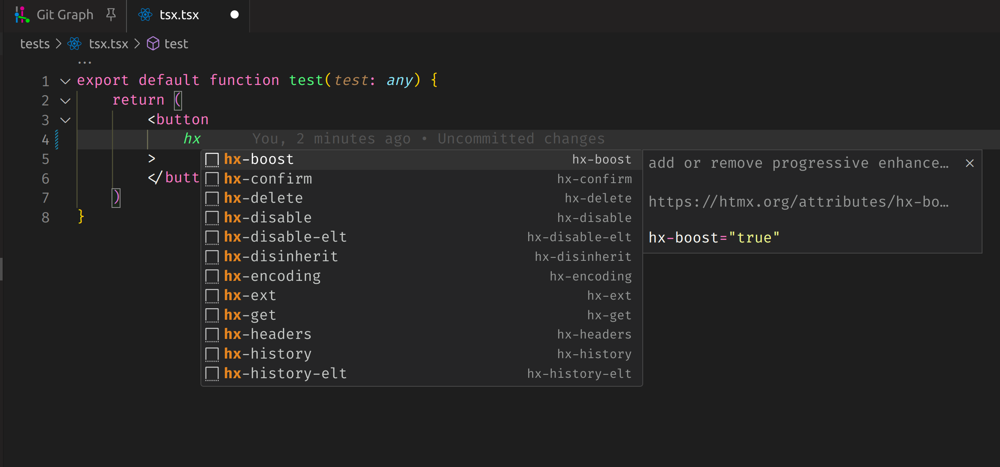

# htmx-attributes

HTMX attribute support for VSCode, enabling your HTMX workflow. HTMX attributes are currently supported in:

- HTML
- JSX
- Go (via Templ)



### Contributions

To contribute a language, do the following:
- Copy over the existing snippet examples,
renaming the files with the language you wish to support (htmx-add-php.json as an example)
- Make an entry in the `package.json` file for your language of choice.
- Make an required adjustments to the snippets for your language.
- Create a test file in the `tests` folder; This is purely for manual
testing before you raise a PR.
- Include an appropriate changeset for your modification before raising a PR.

To install dependencies (ensure you have `vsce` installed):

```bash
bun install
```

To build the extension and test it:

```bash
bun run build
```

This project was created using `bun init` in bun v1.0.14. [Bun](https://bun.sh) is a fast all-in-one JavaScript runtime.
